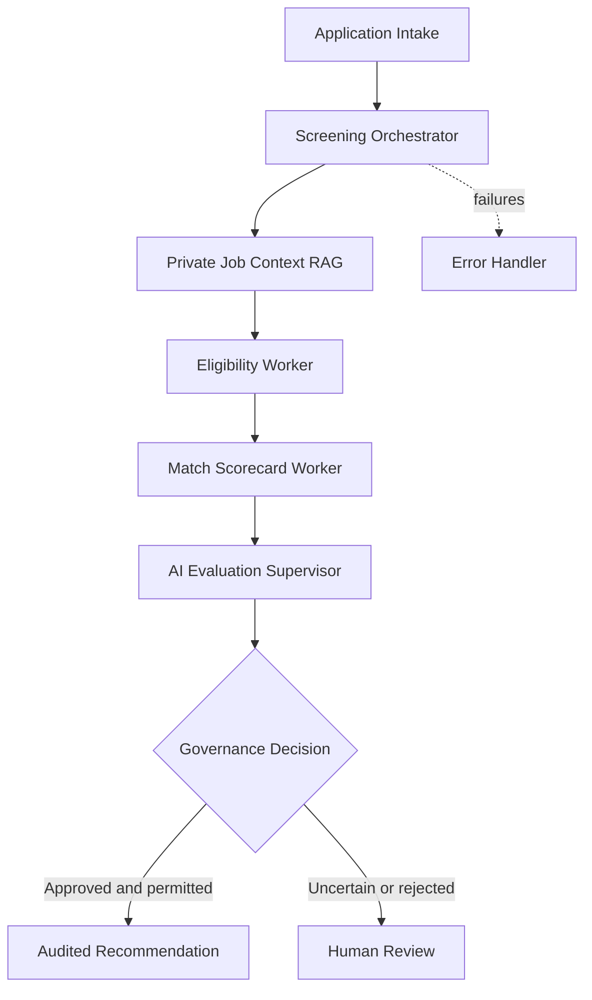

# Agentic Candidate Screening with n8n

An auditable, privacy-aware multi-agent recruiting workflow built in n8n. The system receives candidate material, retrieves the authorized job context from a private knowledge base, evaluates eligibility and match quality, audits the evaluation with an independent AI supervisor, and routes sensitive decisions to a human reviewer.

This repository contains sanitized workflow exports for portfolio and educational use. It does **not** include any employer data, job description, candidate information, API credential, chat identifier, spreadsheet identifier, Data Table identifier, or private knowledge-base document.

## What the project demonstrates

- Manager-worker orchestration across seven independent n8n workflows
- Asynchronous intake with an immediate HTTP 202 response
- Persistent idempotency, duplicate prevention, failure recovery, and controlled retries
- PII minimization before any model call
- Prompt-injection detection for untrusted candidate content
- RAG-based retrieval of job requirements and scoring rubrics
- Separate eligibility and weighted scorecard agents
- Independent AI-as-a-Judge quality assurance
- Human-in-the-loop approval through Telegram
- Structured audit records, trace IDs, token estimates, and cost guardrails

## Supported candidate input

The public intake contract is designed for applications originating in LinkedIn Jobs or another recruiting channel. Candidate data is submitted to the workflow after it is exported or copied from the authorized recruiting interface.

At least one of the following should be supplied:

- Resume text
- Screening-question answers
- Recruiter notes
- Relevant conversation notes

LinkedIn messages and InMail are not scraped. A recruiter may add relevant, job-related conversation content manually through `conversation_notes`. Official real-time LinkedIn ingestion requires an authorized Talent Solutions or ATS integration and is intentionally outside this public example.

## Architecture



See [docs/architecture.md](docs/architecture.md) for the full decision flow.

## Workflows

| File | n8n workflow name | Purpose |
| --- | --- | --- |
| `application-intake.json` | Recruiting - Application Intake | Accepts and normalizes an application, creates trace and idempotency identifiers, returns HTTP 202, and dispatches asynchronous processing. |
| `candidate-screening-orchestrator.json` | Recruiting - Candidate Screening Orchestrator | Applies security and budget guardrails, invokes workers, manages governance, persists audit records, and handles HITL. |
| `job-context-rag-worker.json` | Recruiting - Job Context RAG Worker | Retrieves the authorized job requirements and rubric from a private vector store and validates source metadata. |
| `eligibility-screening-worker.json` | Recruiting - Eligibility Screening Worker | Determines whether every must-have requirement is supported by candidate evidence. |
| `match-scorecard-worker.json` | Recruiting - Match Scorecard Worker | Scores an eligible candidate against the authorized weighted rubric. |
| `ai-evaluation-supervisor.json` | Recruiting - AI Evaluation Supervisor | Audits factual accuracy, evidence sufficiency, rubric consistency, and hallucination risk. |
| `error-handler.json` | Recruiting - Error Handler | Marks failed requests and sends a controlled failure alert. |

## Quick start

1. Import the seven JSON files from `workflows/` into n8n.
2. Configure OpenAI, Google Gemini, and Telegram credentials inside n8n.
3. Create the audit and idempotency Data Tables described in [docs/setup.md](docs/setup.md).
4. Replace every `REPLACE_WITH_WORKFLOW_ID` and `REPLACE_WITH_DATA_TABLE_ID` placeholder through the n8n UI.
5. Provide a private recruiting knowledge-base PDF at the configured runtime path. Do not commit it to Git.
6. Set `REVIEW_TEAM_CHAT_ID` in the n8n runtime environment or supply it securely at execution time.
7. Keep every workflow inactive until configuration and test data validation are complete.

Full instructions are available in [docs/setup.md](docs/setup.md).

## Example request

```json
{
  "source": "linkedin_jobs",
  "linkedin_application_id": "LI-DEMO-0001",
  "candidate_id": "CAND-DEMO-0001",
  "candidate_name": "Sample Candidate",
  "email": "candidate@example.invalid",
  "job_id": "JOB-DEMO-001",
  "resume_text": "Integration engineer with hands-on workflow and API integration experience.",
  "screening_answers": [
    {
      "question": "Describe your integration platform experience.",
      "answer": "Built production workflows and monitored failures across cloud services."
    }
  ],
  "recruiter_notes": "",
  "conversation_notes": "",
  "environment": "staging",
  "deployment_phase": 0,
  "prompt_version": "screening-v1.0",
  "rubric_version": "scorecard-v1.0"
}
```

Additional fictional payloads are available in `examples/`.

## Governance model

The project is designed as decision support, not autonomous hiring software. It does not evaluate protected characteristics and should not be used as the sole basis for employment decisions.

- Candidate content is treated as untrusted input.
- PII is removed before model calls.
- Missing evidence is not treated as proof of a skill.
- The RAG gate prevents evaluation without authorized job context.
- The AI supervisor can freeze autonomy.
- Uncertain, rejected, or policy-sensitive outcomes require human review.
- The public version intentionally stops before contacting candidates or changing ATS records.

## Repository safety

The exports were sanitized to remove credentials and deployment identifiers. Run the validation script before publishing changes:

```bash
python scripts/validate_exports.py
```

See [SECURITY.md](SECURITY.md) before contributing workflow exports.

## Project status

Portfolio-ready reference implementation. The workflow logic is based on a functioning n8n project, but the public exports require local credentials, private knowledge sources, Data Tables, and sub-workflow IDs before activation.

