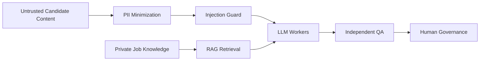

# Architecture

## Processing sequence

1. **Application Intake** accepts normalized candidate evidence and returns HTTP 202.
2. **Idempotency** rejects completed duplicates and reactivates controlled retries after a failed execution.
3. **Data minimization** combines the resume, screening answers, recruiter notes, and optional conversation notes, then masks PII.
4. **Prompt-injection guard** detects instruction-like content before model invocation.
5. **Budget guardrail** checks current model spend before evaluation.
6. **Job Context RAG Worker** retrieves the authorized requirements and rubric from a private knowledge base.
7. **Eligibility Screening Worker** evaluates only must-have requirements.
8. **Match Scorecard Worker** applies the authorized weighted rubric to eligible candidates.
9. **AI Evaluation Supervisor** audits the evaluation for factual grounding, evidence quality, rubric consistency, and hallucination.
10. **Governance routing** determines whether the system may record a recommendation or must request human approval.
11. **Audit and completion** persist the decision route, evidence, model usage, cost estimate, RAG metadata, supervisor result, and trace ID.

## Trust boundaries

Candidate content never defines evaluation policy. Job requirements and scoring rules come from the private RAG source. The supervisor audits the workers but does not alter their scores. Human review remains the final safety boundary for uncertain or rejected evaluations.

## Decision bands

| Band | Meaning | Default route |
| --- | --- | --- |
| `GREEN` | Strong rubric match with validated evidence | Recommendation or human review, depending on deployment phase |
| `YELLOW` | Ambiguous or incomplete evidence | Human review |
| `RED` | Low match score after eligibility | Closed or reviewed according to policy |
| `NOT_ELIGIBLE` | One or more must-haves were not demonstrated | Audited before closure |
| `QA_REVIEW` | Supervisor rejected the evaluation | Autonomy frozen; human review |
| `BLOCKED` | Security guardrail detected instruction-like content | Manual security review |
| `DEFERRED` | Daily model budget was reached | Controlled queue or later retry |
| `NO_RAG_COVERAGE` | Authorized job context was unavailable | Stop evaluation |

## Deployment phases

| Phase | Behavior |
| ---: | --- |
| `0` | Shadow mode; recommendations only |
| `1-2` | Human approval required |
| `3` | Limited autonomous recommendation when confidence, QA, security, and decision-band guardrails all pass |

The public repository deliberately contains no ATS write action and no automated candidate messaging.

